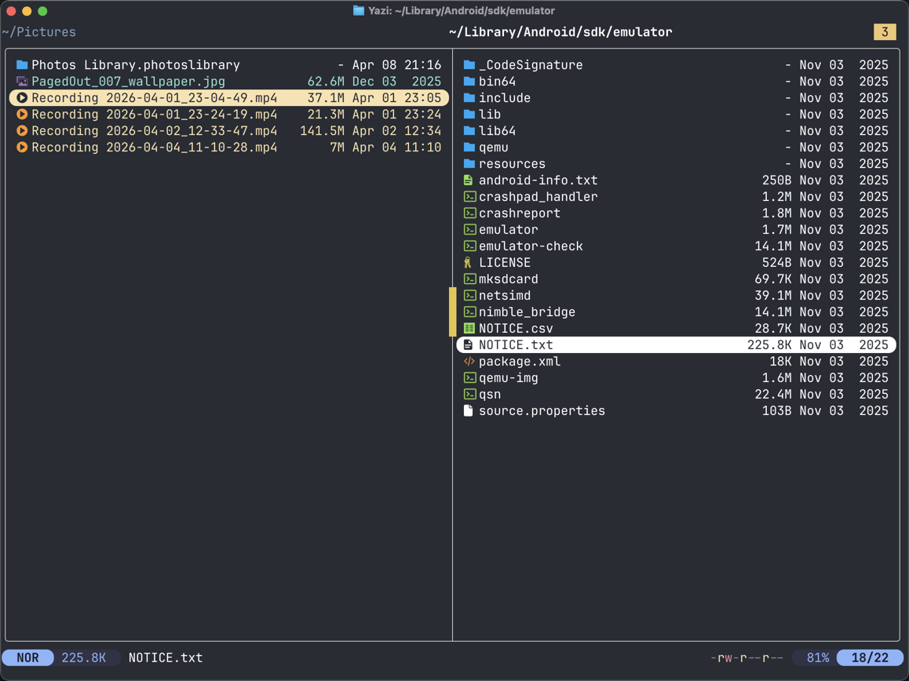

# split-tabs.yazi

<p align="center">
    
</p>

A [Yazi](https://github.com/sxyazi/yazi) plugin that provides a dual-pane view by splitting the screen between two tabs.

## Features
- Toggle dual-pane mode
- Switch focus between panes

## Installation
```sh
ya pkg add terrakok/split-tabs
```
or
```sh
# Windows
git clone https://github.com/terrakok/split-tabs.yazi %AppData%\yazi\config\plugins\split-tabs.yazi
# Linux/macOS
git clone https://github.com/terrakok/split-tabs.yazi ~/.config/yazi/plugins/split-tabs.yazi
```

## Configuration
Add this to your `keymap.toml`:
```
[mgr]
prepend_keymap = [
    { on = "\\", run = "plugin split-tabs spl_toggle", desc = "Split-tabs: toggle" },
    { on = "<Tab>", run = "plugin split-tabs spl_switch_tab", desc = "Split-tabs: switch to the other pane" },
    ...
]
```

## Support the Developer

<p align="center">
  <a href="https://www.buymeacoffee.com/terrakok" target="_blank"></a>
</p>

If you enjoy the project and want to support its development, consider buying me a coffee. Your support helps keep this project free and open-source!
